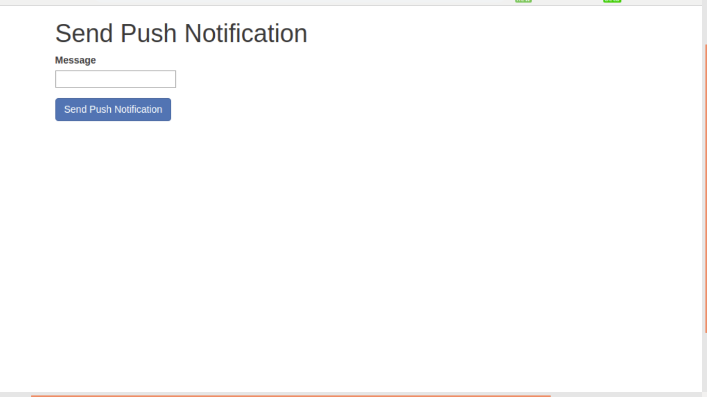
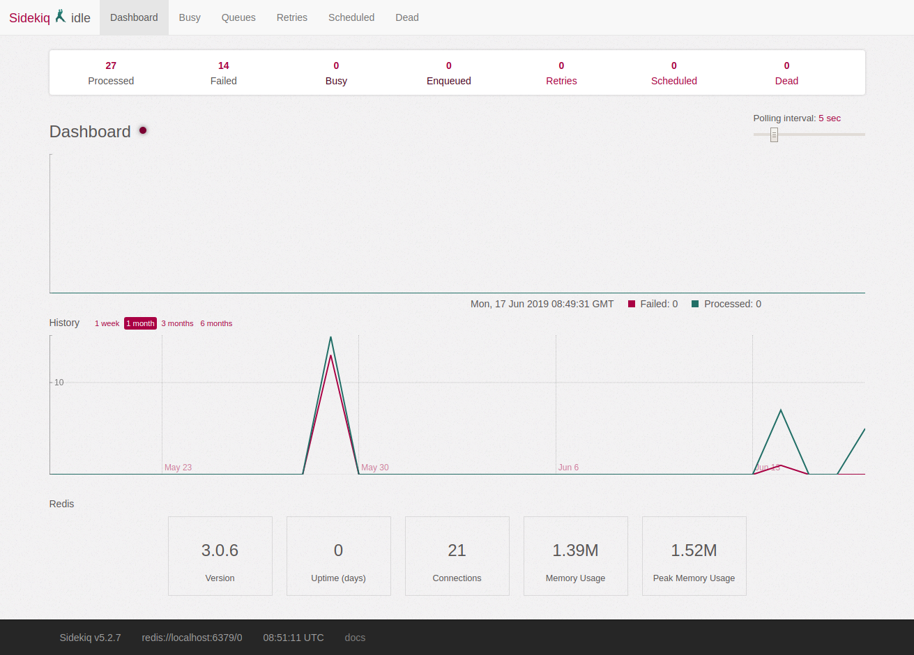

# Push Notifications for Android and iOS with using Background Job (Sidekiq)

Send notifications for android by using Grocer Gem- https://github.com/grocer/grocer and
iOS by using FCM GEM- https://github.com/spacialdb/fcm from backend asynchrouns with
sidekiq as a background job- https://github.com/mperham/sidekiq

* Grocer gem - https://github.com/grocer/grocer
* FCM GEM - https://github.com/spacialdb/fcm
* Sidekiq - https://github.com/mperham/sidekiq

## Prerequisites:
You will need the following things properly installed on your computer.
* ruby -v 2.6.3
* rails -v 5.2.3

## Configuration
See [config/application.example.yml](https://github.com/rorong/push_notification/blob/master/config/application.example.yml).
The required settings are `fcm_key`.

## Installation:
* git clone <repository-url>
* cd <repository>/backend
* bundle install
* cp config/application.example.yml config/application.yml
* cp config/database.example.yml config/database.yml
* rails db:setup && rails db:seed
* cd <repository>/frontend

Running / Development:
* rails s

Add Gem to Gemfile or ignore if exists:

Send push notification in android
* gem 'fcm'

Send push notifications in ios
* gem 'grocer'

Backgroung job
* gem 'sidekiq'

Install Gem:
bundle install

## Requirement:
* device_token stored with mobile app
* platform either android or iOS this is required due to multiple devices.
* Device Token and Platform store in a simple ActiveRecord model

Schema Information

Table name: table_name
* id         :integer          not null, primary key
* email      :string
* device_token      :string
* created_at :datetime         not null
* updated_at :datetime         not null
* platform   :string(255)
